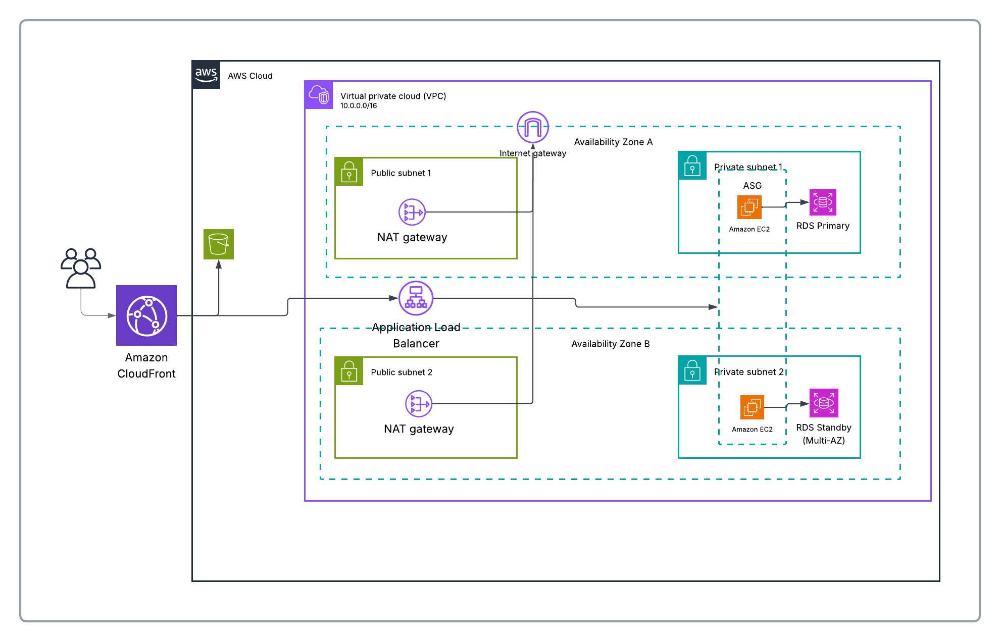

# PersonalHealthTracker


A full-stack web application for tracking personal nutrition and recipes. Users manage their own food items and build recipes from their food inventory, with automatic calorie and protein calculations.

## Table of Contents

- [Features](#features)
- [Technology Stack](#technology-stack)
- [API Reference](#api-reference)
- [Security](#security)
- [Project Structure](#project-structure)
- [Frontend Routes](#frontend-routes)
- [Local Setup & Quickstart](#local-setup--quickstart)
- [Configuration](#configuration)
- [Cloud Deployment & IaC](#cloud-deployment--iac)
- [License](#license)

## Features

- **Secure authentication** — JWT access tokens paired with an HttpOnly refresh-token cookie
- **Food item management** — create, search, list, and batch-delete food items with calorie/protein data
- **Recipe builder** — compose recipes from owned food items with per-item gram amounts
- **Recipe summaries** — instantly view aggregated kcal/protein for any recipe
- **Per-user data isolation** — every user only ever sees and manages their own food items and recipes
- **Role-based access** — `MEMBER` and `ADMIN` roles, with admin features reserved for future use

## Technology Stack

| Layer | Technology |
|-------|------------|
| Frontend | React 18, Vite, React Router |
| Backend | Spring Boot 3, Spring Security |
| Database | PostgreSQL |
| Auth | JWT (access token) + Refresh Token (HttpOnly cookie) |
| Infrastructure | AWS (CloudFront, S3, ALB, EC2 ASG, RDS), CloudFormation |

## API Reference

### Authentication — `/api/v1/auth` (all public)

| Method | Path | Description |
|--------|------|-------------|
| GET | `/username-available` | Check if a username is available |
| POST | `/register` | Create a new user account |
| POST | `/login` | Authenticate and receive tokens |
| POST | `/logout` | Revoke the refresh token (requires auth) |
| POST | `/refresh` | Refresh the access token via cookie |

### Food Items — `/api/fooditem` (auth required)

| Method | Path | Description |
|--------|------|-------------|
| POST | `/` | Create a food item |
| GET | `/` | List food items (paginated, searchable) |
| GET | `/{id}` | Get a single food item |
| DELETE | `/{id}` | Delete a food item |
| DELETE | `/` | Batch delete food items |

### Recipes — `/api/recipe` (auth required)

| Method | Path | Description |
|--------|------|-------------|
| POST | `/` | Create a recipe |
| GET | `/` | List recipes (paginated, searchable) |
| GET | `/{id}` | Get a recipe with full details |
| GET | `/summary/{id}` | Get recipe summary (kcal/protein) |
| DELETE | `/{id}` | Delete a recipe |
| DELETE | `/` | Batch delete recipes |

### User Account — `/useraccount` (auth required)

| Method | Path | Description |
|--------|------|-------------|
| GET | `/{id}` | Get user account details |

## Security

- **Access token**: Bearer JWT in the `Authorization` header, 15-minute expiry (900000 ms)
- **Refresh token**: HttpOnly cookie, used to silently obtain new access tokens
- All `/api/v1/auth/**` routes are public; every other route requires a valid JWT
- Ownership enforcement: a user may only read/write food items and recipes where `owner_id` matches their own `user.getId()`
- **CORS**: origin `http://localhost:3000`, methods `GET, POST, PUT, DELETE, OPTIONS`, credentials enabled

## Project Structure

```
PersonalHealthTracker/
├── backend/
│   ├── src/main/java/com/example/PersonalHealthTracker/
│   │   ├── controllers/      # REST controllers
│   │   ├── services/         # Business logic interfaces
│   │   ├── services/impl/    # Business logic implementations
│   │   ├── repositories/     # Data access
│   │   ├── domain/
│   │   │   ├── entities/     # JPA entities
│   │   │   └── dto/          # Data transfer objects
│   │   ├── mappers/          # Entity-DTO mappers
│   │   ├── security/         # JWT filter, UserDetails
│   │   ├── config/           # Spring configuration
│   │   └── exceptions/       # Custom exceptions
│   ├── src/test/             # Unit and integration tests
│   ├── docker-compose.yml    # Local PostgreSQL
│   └── pom.xml
├── frontend/
│   ├── src/
│   │   ├── api/
│   │   │   ├── auth.js       # Auth API calls
│   │   │   └── api.js        # Generic API helper
│   │   ├── auth/
│   │   │   ├── AuthContext.jsx    # Auth state management
│   │   │   ├── ProtectedRoute.jsx # Redirect unauthenticated users
│   │   │   └── GuestRoute.jsx     # Redirect authenticated users
│   │   ├── components/
│   │   │   ├── TopBar.jsx
│   │   │   ├── NavBar.jsx
│   │   │   ├── Home.jsx
│   │   │   ├── Login.jsx
│   │   │   ├── Register.jsx
│   │   │   ├── ItemGrid.jsx
│   │   │   ├── ItemCard.jsx
│   │   │   ├── RecipeGrid.jsx
│   │   │   └── RecipeCard.jsx
│   │   ├── App.jsx
│   │   ├── App.css
│   │   ├── index.css
│   │   └── main.jsx
│   ├── package.json
│   ├── vite.config.js
│   └── eslint.config.js
└── infrastructure/
    └── personalHealthTrackerProject-template.json          # CloudFormation stack definition
```

## Frontend Routes

| Path | Component | Auth |
|------|-----------|------|
| `/login` | Login | Guest only |
| `/register` | Register | Guest only |
| `/` | Home | Required |
| `/items` | ItemGrid | Required |
| `/recipes` | RecipeGrid | Required |

## Local Setup & Quickstart

### Prerequisites

- Java 17+ and Maven
- Node.js 18+ and npm
- Docker (for local PostgreSQL)
- AWS CLI (only required for cloud deployment)

### Backend

```bash
cd backend
docker-compose up -d      # starts local PostgreSQL
./mvnw spring-boot:run
```

The API is available at `http://localhost:8080` by default.

### Frontend

```bash
cd frontend
cp .env.example .env      # configure environment variables
npm install
npm run dev
```

The frontend dev server runs at `http://localhost:3000` and expects the backend API to be reachable per the settings in `.env`.

## Configuration

**Backend** (`application.properties`)

| Property | Default | Description |
|----------|---------|-------------|
| `jwt.secret` | (embedded) | JWT signing key |
| `jwt.expiry-ms` | 900000 | Access token validity |
| `jwt.refresh.expiration` | 3600000 | Refresh token validity |
| `spring.datasource.url` | localhost:5432 | PostgreSQL connection |
| `app.refresh-token-cookie-samesite` | Lax | Cookie attribute |

> For production, override `jwt.secret` and datasource credentials via environment variables rather than committing them to `application.properties`.

**Frontend**

| File | Purpose |
|------|---------|
| `.env.example` | Template for environment variables |
| `.env.production` | Production values |

## Cloud Deployment & IaC

The application is designed to run on AWS using a highly available, multi-AZ layout:

- **Amazon CloudFront** serves as the entry point for users, fronting both static frontend assets and API traffic.
- **Amazon S3** stores and serves the built frontend static assets behind CloudFront.
- **Application Load Balancer** distributes API traffic across backend instances in two Availability Zones.
- **VPC (10.0.0.0/16)** spans two Availability Zones, each with a public and a private subnet.
  - **Public subnets** host NAT Gateways (one per AZ) and route out through an **Internet Gateway**.
  - **Private subnets** host the backend compute and database, isolated from direct internet access.
- **Auto Scaling Group (ASG) of EC2 instances** runs the Spring Boot backend in each private subnet, scaling based on load.
- **Amazon RDS (PostgreSQL)** runs in the private subnets, deployed per AZ for redundancy and failover.



This layout keeps compute and database resources unreachable from the public internet, while NAT Gateways in each AZ allow outbound connectivity (e.g., patching, external API calls) from the private subnets, and the ALB provides a single, highly available entry point for backend API traffic.

### Packaging & Uploading Deployment Artifacts

Before deploying the CloudFormation stack, build the production artifacts and upload them to your S3 bucket.

**1. Build the frontend assets**

```bash
cd frontend
npm install
npm run build
```

This generates the static frontend files inside `frontend/dist`.

**2. Build the backend JAR**

```bash
cd ../backend
./mvnw clean package -DskipTests
```

This generates `backend/target/PersonalHealthTracker-0.0.1-SNAPSHOT.jar`.

**3. Upload artifacts to S3**

```bash
# Set your unique bucket name
export S3_BUCKET_NAME="your-custom-app-bucket-name"

# Create bucket (skip if CloudFormation creates it for you)
aws s3 mb s3://$S3_BUCKET_NAME

# Upload frontend static assets (for CloudFront / S3 hosting)
aws s3 sync ../frontend/dist s3://$S3_BUCKET_NAME/frontend/ --delete

# Upload backend JAR (for EC2 UserData / deployment scripts)
aws s3 cp target/PersonalHealthTracker-0.0.1-SNAPSHOT.jar s3://$S3_BUCKET_NAME/backend/app.jar
```

### CloudFormation Deployment

```bash
aws cloudformation create-stack \
  --stack-name PersonalHealthTrackerStack \
  --template-body file://infrastructure/personalHealthTrackerProject-template.json \
  --parameters ParameterKey=ArtifactBucket,ParameterValue=$S3_BUCKET_NAME \
  --capabilities CAPABILITY_IAM
```

Monitor the stack until it reaches `CREATE_COMPLETE`:

```bash
aws cloudformation wait stack-create-complete --stack-name PersonalHealthTrackerStack
```

### Tear Down

```bash
aws cloudformation delete-stack --stack-name PersonalHealthTrackerStack
```

> **Note:** Deleting the stack does not automatically empty the S3 artifact bucket. Run `aws s3 rm s3://$S3_BUCKET_NAME --recursive` first if you also want the bucket removed.

## License

This project is licensed under the [GNU General Public License v3.0](LICENSE) (GPLv3). See the [`LICENSE`](LICENSE) file for the full text.
